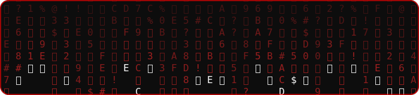

 

 

&nbsp;

&nbsp;

 

## `./whoami`

 

👀 secret.txt

 

 

## `./stack`

 

## `./featured`

| repo | description | stack |
|---|---|---|
| [Simly-DataBase](https://github.com/v1ewy/Simly-DataBase) | file-based database engine — stores and persists data to disk | `C` |
| [Cryptanalyzer](https://github.com/v1ewy/Cryptanalyzer) | decryption tool based on letter substitution | `Python` |

 

## `./telemetry`

 

## `./now`

- leveling up understanding of networks and OS internals
- going through rooms on THM
- learning english

 

